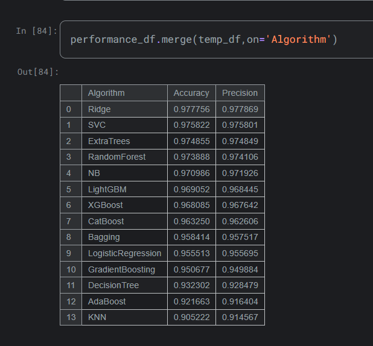
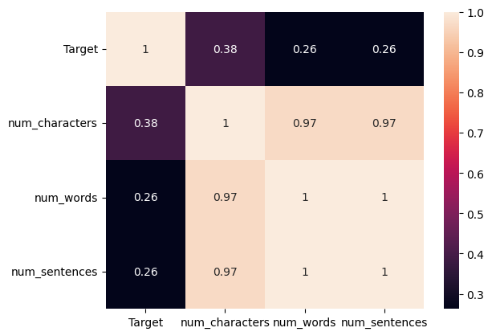

# 📩 Spam SMS Detection using Machine Learning

## 📌 Project Overview

This project focuses on detecting spam SMS messages using Natural Language Processing (NLP) and Machine Learning techniques. The objective is to classify SMS messages into two categories: Spam and Ham (Not Spam) with high accuracy.

The system performs text preprocessing, feature extraction using TF-IDF, and classification using Naive Bayes algorithms.

---

## 🧠 Methodology

### 1. Data Preprocessing

- Lowercasing text
- Removing punctuation
- Removing stopwords
- Tokenization
- Stemming

### 2. Feature Extraction

- TF-IDF Vectorization

### 3. Machine Learning Models



---

## 📊 Model Performance


---

## 📷 Project Screenshots

## 📊 Exploratory Data Analysis (EDA)

### 📌 Data Distribution

The dataset was analyzed to understand the distribution of Spam and Ham messages. This helps evaluate class imbalance and model bias.


### 📌 Data Analysis

Message length distribution was examined to identify structural differences between Spam and Ham messages.
Common words in Spam and Ham messages were visualized to understand discriminative vocabulary patterns.


### Confusion Matrix




## 🔍 Email Spam Prediction Demonstration

The trained model was tested on unseen messages to evaluate real-world prediction capability.

### 📌 Example Prediction Output


The model successfully classifies new input messages into Spam or Ham categories based on learned textual patterns.

## 🛠 Tech Stack

- Python
- Pandas
- NumPy
- Scikit-learn
- Matplotlib
- Seaborn
- NLTK
- Jupyter Notebook

---

## 📂 How to Run the Project

### 1️⃣ Clone the Repository

```
git clone https://github.com/your-username/Spam-SMS-Detection-ML.git
```

### 2️⃣ Navigate to Project Folder

```
cd Spam-SMS-Detection-ML
```

### 3️⃣ Install Required Libraries

```
pip install -r requirements.txt
```

### 4️⃣ Run Jupyter Notebook

```
jupyter notebook
```

---

## 📈 Future Improvements

- Deploy using Flask or Streamlit
- Implement Deep Learning model (LSTM)
- Improve dataset size

---

## 👩‍💻 Author

Parveen Suleman  
BS Information Technology 
Interest Area: Artificial Intelligence, NLP, Machine Learning, Computer Vision, Deep Learning


